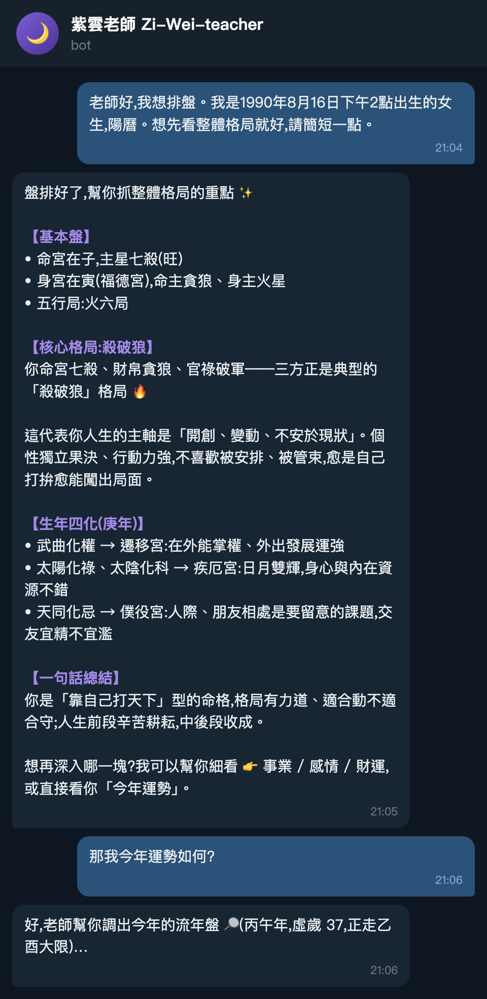

# 紫雲老師 — 紫微斗數 AI 老師 Telegram 機器人

**Zi-Wei-teacher** — A Zi Wei Dou Shu (紫微斗數 / Purple Star Astrology) AI teacher chatbot on Telegram, powered by Claude AI and the iztro astrolabe engine.

一位「非常專業的紫微斗數老師」,住在你的 Telegram 裡:排盤、解盤、看大限流年、合婚、擇日參考,還能從零開始教你紫微斗數。

## 📸 Demo

實際對話效果(示範用出生資料為虛構):

<p align="center">
  
</p>

機器人背後由 iztro 排出的完整命盤(同一份示範資料):

<p align="center">
  
</p>

## ✨ 特色 Features

- 🔮 **精準排盤**:採用 [iztro](https://github.com/SylarLong/iztro) 排盤引擎 —— 十二宮、十四主星與亮度、生年四化、六吉六煞、雜曜、長生/博士十二神,AI 不憑記憶排盤,盤面精確可驗證
- 🧠 **專業解盤**:Claude AI(`claude-opus-4-8`)扮演三十年經驗的命理老師「紫雲老師」,以三合派為主體,懂格局判斷(殺破狼、紫府朝垣、陽梁昌祿、火貪鈴貪⋯)、三方四正、疊宮論法
- 📅 **運限推斷**:大限、流年、流月、流日、流時,支援「今年運勢」「某月吉凶」「擇日參考」
- 💞 **合婚**:提供兩人生辰,對照雙方命盤看互動與互補
- 📚 **系統教學**:初/中/高三階課程,一次一概念、命盤舉例、出題講評,適合想自學紫微斗數的人
- 💬 **多輪對話**:每個聊天室獨立記憶,像跟真人老師連續請教
- ⚖️ **命理倫理**:不做生死疾病斷言、不恐嚇,凶象以提醒與化解方向表達

## 🏗 架構 Architecture

```
Telegram ⇄ Telegraf (Node.js)
              ⇅
        Claude API(紫雲老師角色 + 工具迴圈)
              ⇅ tool calls
        iztro 排盤引擎(本命盤 / 大限 / 流年 / 流月 / 流日 / 流時)
```

```
src/
  index.js        Telegram bot 入口(多輪對話、長訊息分段、逐聊天室佇列)
  claude.js       Claude API + 排盤工具迴圈(tool runner)
  ziwei.js        iztro 排盤與命盤/運限文字化
  systemPrompt.js 紫雲老師的角色與知識體系設定
```

## 🚀 快速開始 Quick Start

需求:Node.js 18+、Telegram 帳號、[Anthropic API key](https://platform.claude.com)

### 1. 建立 Telegram 機器人

1. 在 Telegram 搜尋 **@BotFather**,傳送 `/newbot`
2. 依指示取名(username 需以 `bot` 結尾)
3. 複製 BotFather 給你的 token

### 2. 設定與啟動

```bash
git clone https://github.com/<your-username>/Zi-Wei-teacher.git
cd Zi-Wei-teacher
cp .env.example .env   # 填入 TELEGRAM_BOT_TOKEN 與 ANTHROPIC_API_KEY
npm install
npm start
```

看到 `紫雲老師已上線` 之後,到 Telegram 對你的機器人傳 `/start` 即可開聊。

> ⚠️ **安全提醒**:`.env` 已被 `.gitignore` 排除,請勿以任何形式提交你的 API key 或 bot token。

### 3.(選用)macOS 24 小時常駐

用 `launchd` 讓機器人開機自動啟動、當掉自動重啟 —— 建立 `~/Library/LaunchAgents/com.ziwei.teacher-bot.plist`,設定 `ProgramArguments` 指向 `node src/index.js`、`WorkingDirectory` 指向專案目錄、`KeepAlive` 為 true,然後:

```bash
launchctl bootstrap gui/$(id -u) ~/Library/LaunchAgents/com.ziwei.teacher-bot.plist
```

Linux 伺服器可改用 `systemd` 或 `pm2` 達到相同效果。

## 💬 使用範例 Usage

- 「我是 1990 年 8 月 16 日下午 2 點出生的女生,陽曆,幫我看整體格局」
- 「我今年運勢如何?」「2027 年適合換工作嗎?」
- 「我和男友合不合?」(附上兩人生辰)
- 「下個月哪天適合簽約?」
- 「我是新手,想從零開始學紫微斗數」
- `/clear` 清除記憶重新開始

## 📖 SEO Keywords 關鍵字

紫微斗數 · 紫微斗数 · 紫微命盤 · 排盤 · 斗數排盤 · 命理 · 算命 · 合婚 · 大限 · 流年 · 四化 · AI 算命 · 命理機器人 · Telegram 算命機器人 · Zi Wei Dou Shu · ZiWei · Purple Star Astrology · Chinese Astrology · Chinese Fortune Telling · Astrology Chatbot · Telegram Bot · Claude AI · Anthropic · iztro · Node.js · AI Fortune Teller · Destiny Chart · Natal Chart

## ⚠️ 免責聲明 Disclaimer

本專案僅供命理研究、學習與娛樂參考,不構成醫療、法律、投資等專業建議。
This project is for research, learning, and entertainment purposes only.

## 📄 License

MIT
